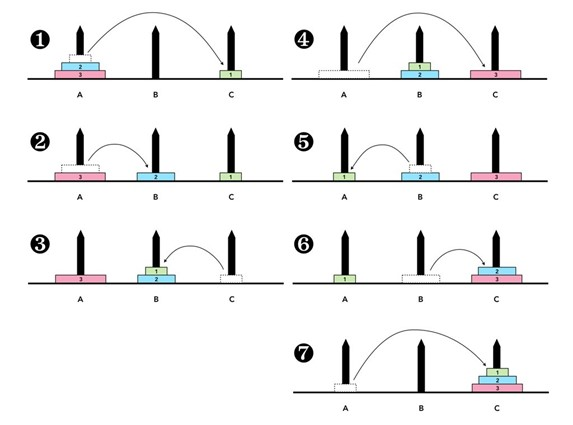
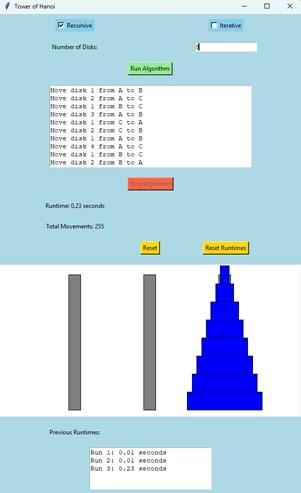
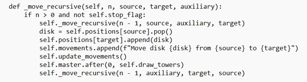

# Tower of Hanoi Problem Solver

## Introduction

The Tower of Hanoi is a classic problem in mathematics and computer science, invented by Édouard Lucas in 1883. It involves 3 towers and a number of disks of different sizes. The objective is to move the entire stack to another rod following certain rules.

### Tower of Hanoi Puzzle

The objective of the puzzle is to move the entire stack to another rod, obeying the following rules:
1. You're only able to move one disk at a time.
2. The highest disk from one stack is removed with each move, and it is then placed either atop another stack or on an empty rod.
3. A disk that is smaller than it cannot be stacked on top of another disk.

## Importance of The Tower of Hanoi

While being a fun and challenging game, the Tower of Hanoi has gained significance in mathematics, computer science, and psychology.
## GUI And GUI’s Functionalities

This is the graphical user interface used to demonstrate the Tower of Hanoi algorithm. It allows users to choose between the recursive and iterative approaches, select the number of disks, and run the algorithm.

## Recursive and Iterative Approach

### Recursive Function

This is the graphical user interface used to demonstrate the Tower of Hanoi algorithm. It allows users to choose between the recursive and iterative approaches, select the number of disks, and run the algorithm.

## Performance of The Algorithm

Both approaches have their own advantages and disadvantages.

### Performance Comparison

- **Recursive Approach**: Time complexity is O(2^n).
- **Iterative Approach**: Time complexity is O(2^n).

### Recursive and Iterative Runtimes

- **3 Disks**: Recursive and Iterative runtimes comparison.
- **12 Disks**: Recursive and Iterative runtimes comparison.

## Conclusion

In this project, both recursive and iterative approaches to solving the Tower of Hanoi problem were successfully implemented. A GUI was designed to visualize the algorithm's steps and allow user interaction. While both approaches have similar time complexities, their runtimes may vary depending on the system's computational power and workload. Overall, this project demonstrates the application of recursive divide and conquer methods in solving complex problems.
## References

1. [Tower of Hanoi - Wikipedia](https://en.wikipedia.org/wiki/Tower_of_Hanoi#cite_ref-oeis_1-0) - Accessed: 21 December 2023.
2. [Shumail Zafar](https://www.quora.com/Where-does-tower-of-Hanoi-carry-great-significance) - Accessed: 21 December 2023.
3. [Recursion – the towers of Hanoi (iii) - The Craft of Coding](https://craftofcoding.wordpress.com/2020/06/23/recursion-the-towers-of-hanoi-iii/) - Accessed: 21 December 2023.
4. [Difference between recursion and iteration - GeeksforGeeks](https://www.geeksforgeeks.org/difference-between-recursion-and-iteration/) - Accessed: 21 December 2023.
